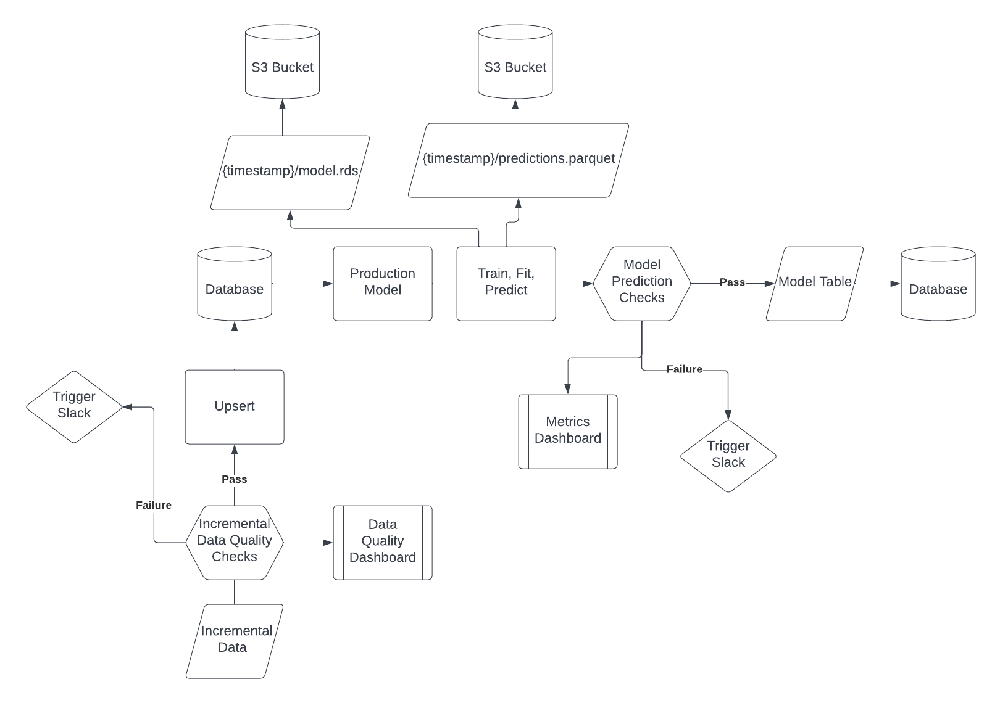

\newpage
```{r setup, include=FALSE}
knitr::opts_chunk$set(echo = TRUE)
library(readr)
library(dplyr)
HouseSales<-read.csv("KC_House_Sales.csv")
```
\newpage
## House Sales in King County, USA data to be used in the Final Project

| Variable| Description |
| :-------:| :------- |
| id| **Unique ID for each home sold (it is not a predictor)**    |
| date| *Date of the home sale*    |
| price| *Price of each home sold*    |
| bedrooms| *Number of bedrooms*    |
| bathrooms| *Number of bathrooms, where ".5" accounts for a bathroom with a toilet but no shower*    |
| sqft_living| *Square footage of the apartment interior living space*    |
| sqft_lot| *Square footage of the land space*    |
| floors| *Number of floors*    |
| waterfront| *A dummy variable for whether the apartment was overlooking the waterfront or not*    |
| view| *An index from 0 to 4 of how good the view of the property was*    |
| condition| *An index from 1 to 5 on the condition of the apartment,*    |
| grade| *An index from 1 to 13, where 1-3 falls short of building construction and design, 7 has an average level of construction and design, and 11-13 has a high-quality level of construction and design.*    |
| sqft_above| *The square footage of the interior housing space that is above ground level*    | 
| sqft_basement| *The square footage of the interior housing space that is below ground level*    |
| yr_built| *The year the house was initially built*    |
| yr_renovated| *The year of the house's last renovation*    |
| zipcode| *What zipcode area the house is in*    |
| lat| *Latitude*    |
| long| *Longitude*    |
| sqft_living15| *The square footage of interior housing living space for the nearest 15 neighbors*    |
| sqft_lot15| *The square footage of the land lots of the nearest 15 neighbors*    |
\newpage
## Instructions:
0.  Join a team with your fellow students with appropriate size (Four Students total)
1.  Load and Review the dataset named "KC_House_Sales'csv
2.	Create the train data set which contains 70% of the data and use set.seed (1023). The remaining 30% will be your test data set.
3.	Investigate the data and combine the level of categorical variables if needed and drop variables as needed. For example, you can drop id, Latitude, Longitude, etc.
4.	Build a regression model to predict price. 
5.	Create scatter plots and a correlation matrix for the train data set. Interpret the possible relationship between the response.
6.	Build the best multiple linear models by using the stepwise selection method. Compare the performance of the best two linear models. 
7.	Make sure that model assumption(s) are checked for the final model. Apply remedy measures (transformation, etc.) that helps satisfy the assumptions. 
8.	Investigate unequal variances and multicollinearity. If necessary, apply remedial methods (WLS, Ridge, Elastic Net, Lasso, etc.). 
9.	Build an alternative model based on one of the following approaches to predict price: regression tree, NN, or SVM.  Check the applicable model assumptions. Explore using a logistic regression. 
10.	Use the test data set to assess the model performances from above.
11.	Based on the performances on both train and test data sets, determine your primary (champion) model and the other model which would be your benchmark model.
12.	Create a model development document that describes the model following this template, input the name of the authors, Harvard IDs, the name of the Group, all of your code and calculations, etc..:

**Due Date: December 18th, 2023 at 11:59 pm EST**

**Notes**
**No typographical errors, grammar mistakes, or misspelled words, use English language**
**All tables need to be numbered and describe their content in the body of the document**
**All figures/graphs need to be numbered and describe their content**
**All results must be accurate and clearly explained for a casual reviewer to fully understand their purpose and impact**
**Submit both the RMD markdown file and PDF with the sections with appropriate explanations. A more formal document in Word can be used in place of the pdf file but must include all appropriate explanations.**

## Executive Summary

This section will describe the model usage, your conclusions and any regulatory and internal requirements. In a real world scneario, this section is for senior management who do not need to know the details. They need to know high level (the purpose of the model, limitations of the model and any issues).

In this report, we describe the development of a statistical model that can be used to predict house sales prices in Kings county, USA based on historic house sales data collected between May 2014 and May 2015. Validation in a test data set showed that the model is significant and has an adjusted R-squared value of ____. The model may be applied to estimate property value for consumers and property market agents, as well as to generate insights into the key factors contributing to home prices. It is important to note that we expect the model to work well only in geographical locations within King County and within a limited time frame into the future. As such, we have also included a model monitoring plan to detect substantial future deviations of our model.

\newpage
## I. Introduction (5 points)

*This section needs to introduce the reader to the problem to be resolved, the purpose, and the scope of the statistical testing applied. What you are doing with your prediction? What is the purpose of the model? What methods were trained on the data, how large is the test sample, and how did you build the model?*

In this project, our goal is to build a statistical model that can predict house sales prices in Kings county, USA based on house sales data collected in that area between May 2014 and May 2015. The dataset contains information on 21613 houses, including the sale price, number of rooms, square footage, year built and renovated, view, and condition of the property. The house sale price was used as the outcome variable and all other variables were considered as independent variables. 70% of the dataset was used as training set and 30% was used as testing set. 

Using this framework, we built several different models using linear regression, logistic regression, regression tree, and neural network. When building each model, feature selection methods were used and the appropriate diagnostic tests were applied to verify that model assumptions were met. <TODO: Elaborate more on each model>

Finally, the performance of each models was evaluated by its accuracy in predicting house prices in the test set, specifically by examining the adjusted R-squared and MSE of predicted values. Based on that, we propose that the best predictive model is _____. This model indicated that the most important factors that influence house prices in King County, USA are ______. This model may be useful for estimating property prices for home buyers, sellers, or property market professionals. It may also contribute to research on key factors contributing to home prices. Importantly, we expect the model to be valid only in geographical locations within King County and within a limited time frame into the future. We have also detailed a model monitoring plan to detect substantial deviations of our model in the future.

\newpage
## II. Description of the data and quality (15 points)

*Here you need to review your data, the statistical test applied to understand the predictors and the response and how are they correlated. Extensive graph analysis is recommended. Is the data continuous, or categorical, do any transformation needed? Do you need dummies? *

```{r}
library(ggplot2)
library(corrplot)
```

```{r}
str(HouseSales)
```

By looking at the structure of the data set, it is found that the variables "date" and "price" are in character format and need to be converted to numeric format. Also, we split the "date" into "year" and "month" and drop the variable "id", which is not a predictor.

```{r}
# Data cleaning (price)
df = read.csv("KC_House_Sales.csv")
df$price = parse_number(df$price)
```

```{r}
# Transformation (date)
df$year = as.integer(substr(df$date, 1, 4))
df$month = as.integer(substr(df$date, 5, 6))
year = df$year
month = df$month
df = subset(df, select = -c(id, date))
```

The variable "year" has only two categories, 2014 and 2015, and does not need further processing. However, "month" is a multi-categorical variable, so it is not ideal to use only one regression coefficient to explain the change in relationship between the multi-categorical variables and its influence on the dependent variable. Therefore, we convert "month" into 12 dummy variables representing different months, using "1" for "yes" and "0" for "no". In this way, the results of regression are easier to interpret and have more practical utility, for example in pointing out the months that have particularly strong influence on house pricing.

```{r}
# dummy (month, True(1), False(0))
df$month_Jan = ifelse(df$month == 1, 1, 0)
df$month_Feb = ifelse(df$month == 2, 1, 0)
df$month_Mar = ifelse(df$month == 3, 1, 0)
df$month_Apr = ifelse(df$month == 4, 1, 0)
df$month_May = ifelse(df$month == 5, 1, 0)
df$month_Jun = ifelse(df$month == 6, 1, 0)
df$month_Jul = ifelse(df$month == 7, 1, 0)
df$month_Aug = ifelse(df$month == 8, 1, 0)
df$month_Sep = ifelse(df$month == 9, 1, 0)
df$month_Oct = ifelse(df$month == 10, 1, 0)
df$month_Nov = ifelse(df$month == 11, 1, 0)
df$month_Dec = ifelse(df$month == 12, 1, 0)

df = subset(df, select = -(month))
```

For the same reason, the variable "zipcode", as a multi-categorical variable with 199 categories, also needs to be converted into a dummy variable. Considering that zip codes can be used for positioning, we divided the variable "zipcode" into two categories, one format "980xx" and the other format "981xx", so that it can represent two different regions. "981xx" largely corresponds to areas within Seattle, WA and "980xx" specifies the neighboring suburban areas.

```{r}
# dummy (zipcode, Divided into two groups, 980xx and 981xx)
df$zipcode_start = as.integer(substr(df$zipcode, 1, 3))
df = subset(df, select = -(zipcode))

knitr::kable(table(df$zipcode_start), col.names=c("zipcode","frequency"))
```


```{r}
# Split into train/ test set:
set.seed(1023)
sample = sample(c(TRUE, FALSE), nrow(df), replace = TRUE, prob = c(0.7, 0.3))
train = df[sample, ]
test = df[!sample, ]

summary(train)
```

Through the correlation matrix and graph, it can be found that variables "sqft_living", "grade", "sqft_above" and "sqft_living15" have a relatively high correlation with the response variable "price", around 0.6. However, the variables "sqft_lot", "condition", "yr_built", "long", "sqft_lot15", "year", "zipcode_start" and 12 different months have a very low correlation with "price", all below 0.1.

```{r}
cor_matrix = round(cor(train), 3)
cor_matrix
```

```{r}
corrplot(cor_matrix, method = "circle")
```

To further examine the top variables correlating with "price", we plot several scatter plots below. This initial analysis shows that price is indeed positively correlated with "sqft_living", "grade", "sqft_above" and "sqft_living15". It also appears that the prices of homes show a large range from 75,000 to 7,700,000, with most data points concentrated on the lower half of this scale. We will perform further testing during model development to understand if a transformation of the price variable would be beneficial.

```{r, fig.width=7}
par(mfrow=c(2,2))

top.corr<-c("sqft_living", "grade", "sqft_above", "sqft_living15")
for (i in top.corr){
  plot(x=df[,i],y=df[,"price"], main = paste("price vs",i), col= "lightblue",
       xlab=i,ylab="price")
}
```


Using bar charts and boxplots, we can observe the types and distribution of all variables. The results are summarized in the table below.

```{r, fig.width=7}
# Bar charts
par(mfrow=c(2,3))

for (i in 1:ncol(df)){
  hist(df[,i], main = names(df[i]), xlab = NULL, col = "lightblue")
}

```

```{r, fig.width=7}
# Boxplots on continuous variables only
par(mfrow=c(2,3))

categorical.var<-c("bedrooms","bathrooms","floors","waterfront","view","condition","grade","yr_built","yr_renovated","year","zipcode_start",colnames(df)[grep("month",colnames(df))])
df.boxplot<-dplyr::select(df,-all_of(categorical.var))

for (i in 1:ncol(df.boxplot)){
  boxplot(df.boxplot[,i], main = names(df.boxplot[i]), xlab = NULL, col = "lightblue")
}

```

## Summary table of data description

| Variable| Description | Type | Correlation with "price" |
| :-------:| :-------: | :-------: | :-------: |
| price| **Price of each home sold (Response variable)**    | continuous| 1|
| bedrooms| *Number of bedrooms*    | categorical| 0.306|
| bathrooms| *Number of bathrooms, where ".5" accounts for a bathroom with a toilet but no shower*    | categorical| 0.522|
| sqft_living| *Square footage of the apartment interior living space*    | continuous| 0.707|
| sqft_lot| *Square footage of the land space*    | continuous| 0.092|
| floors| *Number of floors*    | categorical| 0.363|
| waterfront| *A dummy variable for whether the apartment was overlooking the waterfront or not*    | categorical| 0.291|
| view| *An index from 0 to 4 of how good the view of the property was*    | categorical| 0.393|
| condition| *An index from 1 to 5 on the condition of the apartment,*    | categorical| 0.050|
| grade| *An index from 1 to 13, where 1-3 falls short of building construction and design, 7 has an average level of construction and design, and 11-13 has a high-quality level of construction and design.*    | categorical| 0.669|
| sqft_above| *The square footage of the interior housing space that is above ground level*    | continuous| 0.607|
| sqft_basement| *The square footage of the interior housing space that is below ground level*    | continuous| 0.335|
| yr_built| *The year the house was initially built*    | categorical| 0.051|
| yr_renovated| *The year of the house's last renovation*    | categorical| 0.129|
| lat| *Latitude*    | continuous| 0.306|
| long| *Longitude*    | continuous| 0.017|
| sqft_living15| *The square footage of interior housing living space for the nearest 15 neighbors*    | continuous| 0.589|
| sqft_lot15| *The square footage of the land lots of the nearest 15 neighbors*    | continuous| 0.081|
| year| *Year of the home sale* | categorical| 0.005|
| month_Jan| *A dummy variable for whether it is January or not* | categorical| -0.007|
| month_Feb | *A dummy variable for whether it is February or not* | categorical| -0.025|
| month_Mar| *A dummy variable for whether it is March or not* | categorical| 0.004|
| month_Apr| *A dummy variable for whether it is April or not* | categorical| 0.019|
| month_May| *A dummy variable for whether it is May or not* | categorical| 0.016|
| month_Jun| *A dummy variable for whether it is June or not* | categorical| 0.017|
| month_Jul| *A dummy variable for whether it is July or not* | categorical| 0.010|
| month_Aug| *A dummy variable for whether it is August or not* | categorical| -0.005|
| month_Sep| *A dummy variable for whether it is September or not* | categorical| -0.017|
| month_Oct| *A dummy variable for whether it is October or not* | categorical| -0.0001|
| month_Nov| *A dummy variable for whether it is November or not* | categorical| -0.013|
| month_Dec| *A dummy variable for whether it is December or not* | categorical| -0.015|
| zipcode_start| *A dummy variable that indicates whether zipcode starts with 980 or 981* | categorical| -0.007|


The barplots and boxplots further indicate that distribution of price is skewed towards the right, with a median of 450,000 and a small subset of houses that are over 2,000,000. Several other factors also show a similar right-skewed distribution, for example "sqft_living" and "sqft_lot". We also notice some data points that may be outliers, for example a house that has 33 bedrooms or some houses that are recorded as having 0 bedroom 0 bathrooms. Further testing will be performed below to evaluate whether variable transformation is needed for model building.


\newpage
## III. Model Development Process (15 points)

*Build a regression model to predict price.  And of course,  create the train data set which contains 70% of the data and use set.seed (1023). The remaining 30% will be your test data set. Investigate the data and combine the level of categorical variables if needed and drop variables. For example, you can drop id, Latitude, Longitude, etc. *

```{r section3a}
set.seed(1023)

response <- "price"

#Renaming to conform to unified convention
kc.house.df <- df %>% rename("year_built" = "yr_built")
```

```{r section3b}
#Feature Ideas
#Quality Adjusted Features
transform_sqft_adj_grade <- function(kc.house.df){
  
  sqft_adj_grade <- kc.house.df[, "sqft_living"] / kc.house.df[, "grade"]
  
  return (sqft_adj_grade)
}

transform_sqft_adj_condition <- function(kc.house.df){
  
  sqft_adj_condition <- kc.house.df[, "sqft_living"] / kc.house.df[, "condition"]
  
  return (sqft_adj_condition)
}

transform_sqft_adj_waterfront <- function(kc.house.df){
  
  sqft_adj_waterfront <- kc.house.df[, "sqft_living"] * kc.house.df[, "waterfront"]
  
  return (sqft_adj_waterfront)
}

transform_poly_sqft_living <- function(kc.house.df){
  #Center variables for polynomial terms
  sqft_living <- (kc.house.df$sqft_living - mean(kc.house.df$sqft_living)) 
  sqft_living_squared <- sqft_living^2
  
  return (list(center = sqft_living, squared = sqft_living_squared))
}

transform_poly_floor <- function(kc.house.df){
  floors <- (kc.house.df$floors - mean(kc.house.df$floors)) 
  floors_squared <- floors^2
  
  return(list(center = floors, squared = floors_squared))
}
```

Centering the variables do not change the interpretation of the coefficients. However they do change the interpretation of the intercept. Instead of the intercept being read as the value of price when all variables are zero. It is not read as price when all variables are zero, `floors` is equal to its average and `sqft_living` is equal to its average.

```{r section3c}
# Drop December dummy variable due to collinearity with other months
kc.house.df2<-dplyr::select(kc.house.df,-(month_Dec))

#Apply transformations 

kc.house.df$sqft_adj_grade <- transform_sqft_adj_grade(kc.house.df)
kc.house.df$sqft_adj_condition <- transform_sqft_adj_condition(kc.house.df)
kc.house.df$sqft_adj_waterfront <- transform_sqft_adj_waterfront(kc.house.df)

res <- transform_poly_sqft_living(kc.house.df)
kc.house.df$sqft_living <- res$center
kc.house.df$sqft_living_squared <- res$squared

res <- transform_poly_floor(kc.house.df)
kc.house.df$floors <- res$center
kc.house.df$floors_squared <- res$squared

#Remove collinear variables
# sqft_basement + sqft_above = sqft_living
kc.house.df$sqft_basement <- NULL
```

```{r section3d}
set.seed(1023)

#use 70% of dataset as training set and 30% as test set
train_prop <- 0.7

index <- sample(1:nrow(HouseSales), size = round(train_prop * nrow(kc.house.df)))
kc.house.train.X <- kc.house.df[index, -which(names(kc.house.df) %in% c(response))] # modified slightly 
kc.house.train.y <- kc.house.df [index, response]

kc.house.test.X <- kc.house.df [-index, -which(names(kc.house.df) %in% c(response))]
kc.house.test.y <- kc.house.df [-index, response]
```

```{r}
#baseline model
baseline.model <- lm(price ~ ., data = cbind(price = kc.house.train.y, kc.house.train.X))
summary(baseline.model)
```


\newpage

## IV. Model Performance Testing (15 points)

*Use the test data set to assess the model performances. Here, build the best multiple linear models by using the stepwise both ways selection method. Compare the performance of the best two linear models. Make sure that model assumption(s) are checked for the final linear model. Apply remedy measures (transformation, etc.) that helps satisfy the assumptions. In particular you must deeply investigate unequal variances and multicollinearity. If necessary, apply remedial methods (WLS, Ridge, Elastic Net, Lasso, etc.). *


```{r part IV - Fitting the baseline model on the test set}

#Function to generate model performance
CalcTestMetrics <- function(pred, act, n, p) {
  SST <- var(act)*(length(act)-1)
  SSE <- sum((act-pred)^2)
  SSR <- sum(pred - mean(act))^2
  rsquared <- 1- SSE/SST
  
  adj.rsquared <- 1 - (((1 - rsquared)*(n-1)) / (n-p-1))
  mse <- sum((act - pred)^2) / (n-p)
  mae <- (sum(abs(act-pred))) / n
  
  c(adj.rsquared = adj.rsquared, 
    rsquared = rsquared, 
    mse = mse, 
    mae = mae)
}

# Coefficients
coeff.lm.df <- data.frame(Baseline = baseline.model$coefficients)
coeff.lm.df$Coefficients <- rownames(coeff.lm.df)
rownames(coeff.lm.df) <- NULL
coeff.lm.df <- dplyr::select(coeff.lm.df, Coefficients, Baseline) 
coeff.q1.df <-
  coeff.lm.df %>%
  dplyr::mutate(Baseline = ifelse(Baseline == 0, "--", scales::comma(Baseline, accuracy = 1e-4)))
knitr::kable(coeff.q1.df, caption = "Model Coefficients")


# Using the function to calculate performance of the baseline model on the test set
pred <- predict(baseline.model, kc.house.test.X)
act <- kc.house.test.y
n <- dim(model.matrix(baseline.model)[, -1])[1]
p <- dim(model.matrix(baseline.model)[, -1])[2]

performance_baseline = CalcTestMetrics(pred, act, n, p)
performance_baseline
```


```{r part IV - Stepwise both ways}
library(olsrr)
stepwise_model = ols_step_both_p(baseline.model, pent=0.35, prem=0.05)
stepwise_final = stepwise_model$model
summary(stepwise_final)
```
Stepwise didn't give us anything more in terms of prediction, but reduced the varibles as intended. Following, I`ll identify which variables were selected (and create a new dataframe to which we will use in our next interactions) and identify the ones dropped.
```{r part IV -Identifying selected and eliminated variables}
#Generating new dataframes with only the selected variables
selected_variables = names(coef(stepwise_final))
selected_variables = setdiff(selected_variables, "(Intercept)")
selected_train_df = kc.house.train.X[, selected_variables]
selected_test_df = kc.house.test.X[, selected_variables]

#Finding out which ones were dropped
original_predictors = names(kc.house.train.X)
dropped_variables = setdiff(original_predictors, selected_variables)

dropped_variables
```
Seems like we dropped 12 variables from our original 31. Of those 12, 10 were dummy month variables we generated, and sqft_lot and sqft_above.

```{r part IV - Checking multicollinearity with VIF}
#Fitting a new linear model with selected variables
selected_linear_model = lm(price ~ . , data = cbind(price = kc.house.train.y, selected_train_df))

# Coefficients
coeff.sw.df <- data.frame(Stepwise = selected_linear_model$coefficients)
coeff.sw.df$Coefficients <- rownames(coeff.sw.df)
coeff.q1.df <-
  coeff.q1.df %>%
  dplyr::left_join(coeff.sw.df, by = "Coefficients") %>%
  dplyr::mutate(Stepwise = ifelse(dplyr::coalesce(Stepwise, 0) == 0, "--", 
                                  scales::comma(Stepwise, accuracy = 1e-4)))
knitr::kable(coeff.q1.df, caption = "Model Coefficients")


pred_selected <- predict(selected_linear_model, selected_test_df)
act_selected <- kc.house.test.y
n_selected <- dim(model.matrix(selected_linear_model)[, -1])[1]
p_selected <- dim(model.matrix(selected_linear_model)[, -1])[2]

performance_selected = CalcTestMetrics(pred_selected, act_selected, n_selected, p_selected)
print(performance_selected)


#Checking performance on the test set
library(car)
vif_values = vif(selected_linear_model)
variable_names <- names(vif_values)
vif_values <- as.numeric(vif_values)

# Create a data frame with variable names and VIF values
vif_results <- data.frame(Variable = variable_names, VIF = vif_values)

# Print the VIF results
print(vif_results)
```
We got 4 variables above our cutoff 10 Vif value: sqft_living, grade, sqft_adj_grade and sqft_adj_condition.I don't think they add much to interpretability, so I'm excluding them for now (maybe returning them when we use other remedial measures, like ridge regression)

```{r part IV - Checking assumptions, fig.width=8}
# First we eliminate the variables with high multicollinearity we just found out and fit a new linear model
#VIF_eliminated = c("sqft_adj_grade", "sqft_adj_condition")
#selected_train_df = selected_train_df[, !names(selected_train_df) %in% VIF_eliminated]
#selected_test_df = selected_test_df[, !names(selected_test_df) %in% VIF_eliminated]

#selected_linear_model = lm(price ~ . , data = cbind(price = kc.house.train.y, selected_train_df))

#pred_selected <- predict(selected_linear_model, selected_test_df)
#act_selected <- kc.house.test.y
#n_selected <- dim(model.matrix(selected_linear_model)[, -1])[1]
#p_selected <- dim(model.matrix(selected_linear_model)[, -1])[2]

#performance_selected = cbind(CalcTestMetrics(pred_selected, act_selected, n_selected, p_selected))
#print(performance_selected)

plot(selected_linear_model)
```
```{r part IV - Applying transformantions,fig.width=8}
library(MASS)
boxcox(selected_linear_model,lambda=seq(-0.2,0.2,0.01))
transformed_model = lm(log(price) ~ . , data = cbind(price = kc.house.train.y, selected_train_df))
summary(transformed_model)
plot(transformed_model)
```
After transforming the model (log of the price), the assumptions seem to be fine. Just to be sure on normality, let's do some tests.

```{r part IV - Normality tests}
std_residuals = rstandard(transformed_model)

library(nortest)
ad.test(std_residuals)

lillie.test(std_residuals)

```
It seems like normality does not hold, even though the Q-Q plot looks much better after transformation. Looks like the standardized residuals are heavy on the tails, and normality tests shows that normality does not hold as well. It's up to question if this is  a huge problem, considering the size of the data set. However, non-parametric models should (and will, in the next part) be tried for better results, since some does not need those assumptions to work.

```{r part IV - Performance of transformed model}
y_test = log(kc.house.test.y)

# Coefficients
coeff.tr.df <- data.frame(Transformed = transformed_model$coefficients)
coeff.tr.df$Coefficients <- rownames(coeff.tr.df)
coeff.q1.df <-
  coeff.q1.df %>%
  dplyr::left_join(coeff.tr.df, by = "Coefficients") %>%
  dplyr::mutate(Transformed = ifelse(dplyr::coalesce(Transformed, 0) == 0, "--", 
                                  scales::comma(Transformed, accuracy = 1e-4)))
knitr::kable(coeff.q1.df, caption = "Model Coefficients")


pred_transformed = predict(transformed_model, selected_test_df)
act_transformed <- y_test
n_transformed <- dim(model.matrix(transformed_model)[, -1])[1]
p_transformed <- dim(model.matrix(transformed_model)[, -1])[2]

performance_transformed = CalcTestMetrics(pred_transformed, act_transformed, n_transformed, p_transformed)
print(performance_transformed)
```

```{r problem IV - Ridge regression}
library(glmnet)

x= data.matrix(selected_train_df)
y= log(kc.house.train.y)

ridge_model = cv.glmnet(x,y,alpha=0, nlambda=100,lambda.min.ratio=0.0001)
best_lambda_ridge = ridge_model$lambda.min

# Coefficients Best Lambda
coeff.ridge.df <- stats::coef(ridge_model , s = best_lambda_ridge)
coeff.ridge.df <- data.frame(Coefficients = coeff.ridge.df@Dimnames[[1]],
                             Ridge = coeff.ridge.df@x)
coeff.q1.df <-
  coeff.q1.df %>%
  dplyr::left_join(coeff.ridge.df, by = "Coefficients") %>%
  dplyr::mutate(Ridge = ifelse(dplyr::coalesce(Ridge, 0) == 0, "--", 
                               scales::comma(Ridge, accuracy = 1e-4)))
knitr::kable(coeff.q1.df, caption = "Model Coefficients")

#Performance
pred_ridge = predict(ridge_model, s = best_lambda_ridge, 
                 newx = data.matrix(selected_test_df))[,1]
act_ridge <- y_test
n_ridge <- dim(model.matrix(transformed_model)[, -1])[1]
p_ridge <- dim(model.matrix(transformed_model)[, -1])[2]

performance_ridge = CalcTestMetrics(pred_ridge, act_ridge, n_ridge, p_ridge)
print(performance_ridge)

```


```{r problem IV - Lasso regression}
library(glmnet)
lasso_model = cv.glmnet(x,y,alpha=1, nlambda=100,lambda.min.ratio=0.0001)
best_lambda_lasso = lasso_model$lambda.min

# Coefficients
coeff.lasso <- stats::coef(lasso_model, s = "lambda.min")
coeff.lasso.names <- coeff.lasso@Dimnames[[1]]
coeff.lasso.df <- data.frame()
for (i in 1:length(coeff.lasso)) {
  df <- data.frame(Coefficients = coeff.lasso.names[i],
                   Lasso = coeff.lasso[i])
  coeff.lasso.df <- rbind(df, coeff.lasso.df)
}
coeff.q1.df <-
  coeff.q1.df %>%
  dplyr::left_join(coeff.lasso.df, by = "Coefficients") %>%
  dplyr::mutate(Lasso = ifelse(dplyr::coalesce(Lasso, 0) == 0, "--", 
                               scales::comma(Lasso, accuracy = 1e-4)))
knitr::kable(coeff.q1.df, caption = "Model Coefficients")

#Performance
pred_lasso = predict(lasso_model, s = best_lambda_lasso, 
                 newx = data.matrix(selected_test_df))[,1]
act_lasso <- y_test
n_lasso <- dim(model.matrix(transformed_model)[, -1])[1]
p_lasso <- dim(model.matrix(transformed_model)[, -1])[2]

performance_lasso = CalcTestMetrics(pred_lasso, act_lasso, n_lasso, p_lasso)
print(performance_lasso)

```

```{r problem IV - Elastic net regression}
enet_model = cv.glmnet(x,y,alpha=0.5, nlambda=100,lambda.min.ratio=0.0001)
best_lambda_enet = enet_model$lambda.min

# Coefficients
coeff.en <- stats::coef(enet_model, s = best_lambda_enet)
coeff.en.names <- coeff.en@Dimnames[[1]]
coeff.en.df <- data.frame()
for (i in 1:length(coeff.en)) {
  df <- data.frame(Coefficients = coeff.en.names[i],
                   ElasticNet = coeff.en[i])
  coeff.en.df <- rbind(df, coeff.en.df)
}
coeff.q1.df <- 
  coeff.q1.df %>%
  dplyr::left_join(coeff.en.df, by = "Coefficients") %>%
  dplyr::mutate(ElasticNet = ifelse(dplyr::coalesce(ElasticNet, 0) == 0, "--", 
                                    scales::comma(ElasticNet, accuracy = 1e-4)))
knitr::kable(coeff.q1.df, caption = "Model Coefficients")

#Performance
pred_enet = predict(enet_model, s = best_lambda_enet, 
                 newx = data.matrix(selected_test_df))[,1]
act_enet <- y_test
n_enet <- dim(model.matrix(transformed_model)[, -1])[1]
p_enet <- dim(model.matrix(transformed_model)[, -1])[2]

performance_enet = CalcTestMetrics(pred_enet, act_enet, n_enet, p_enet)
print(performance_enet)

```

```{r problem IV - Elastic net regression without transformation}
x1= data.matrix(selected_train_df)
y1= kc.house.train.y

enet_model1 = cv.glmnet(x1,y1,alpha=0.5, nlambda=100,lambda.min.ratio=0.0001)
best_lambda_enet = enet_model$lambda.min

# Coefficients
coeff.en <- stats::coef(enet_model1, s = best_lambda_enet)
coeff.en.names <- coeff.en@Dimnames[[1]]
coeff.en.df <- data.frame()
for (i in 1:length(coeff.en)) {
  df <- data.frame(Coefficients = coeff.en.names[i],
                   ElasticNetNonTrans = coeff.en[i])
  coeff.en.df <- rbind(df, coeff.en.df)
}
coeff.q1.df <- 
  coeff.q1.df %>%
  dplyr::left_join(coeff.en.df, by = "Coefficients") %>%
  dplyr::mutate(ElasticNetNonTrans = ifelse(dplyr::coalesce(ElasticNetNonTrans, 0) == 0, "--", 
                                    scales::comma(ElasticNetNonTrans, accuracy = 1e-4)))
knitr::kable(coeff.q1.df, caption = "Model Coefficients")

#Performance

y_test1 = kc.house.test.y

pred_enet = predict(enet_model1, s = best_lambda_enet, 
                 newx = data.matrix(selected_test_df))[,1]
act_enet <- y_test1
n_enet <- dim(model.matrix(transformed_model)[, -1])[1]
p_enet <- dim(model.matrix(transformed_model)[, -1])[2]

performance_enet = CalcTestMetrics(pred_enet, act_enet, n_enet, p_enet)
print(performance_enet)

```


```{r problem IV - Robust regression}
robust_model = rlm(log(price) ~ . , data = cbind(price = kc.house.train.y, selected_train_df), psi = psi.huber)
summary(robust_model)

# Coefficients
coeff.huber.df <- data.frame(Robust = robust_model$coefficients)
coeff.huber.df$Coefficients <- rownames(coeff.huber.df)
coeff.q1.df <-
  coeff.q1.df %>%
  dplyr::left_join(coeff.huber.df, by = "Coefficients") %>%
  dplyr::mutate(Robust = ifelse(dplyr::coalesce(Robust, 0) == 0, "--",
                               scales::comma(Robust, accuracy = 1e-4)))
knitr::kable(coeff.q1.df, caption = "Model Coefficients")

#Performance
pred_robust = predict(robust_model, selected_test_df)
act_robust <- y_test
n_robust <- dim(model.matrix(robust_model)[, -1])[1]
p_robust <- dim(model.matrix(robust_model)[, -1])[2]

performance_robust = CalcTestMetrics(pred_robust, act_robust, n_robust, p_robust)
print(performance_robust)

```
With robust performance, it does not seem that outliers matter much (after transformation at least)

```{r problem IV - R2 table}
library(knitr)
library(dplyr)

results_df <- data.frame(
  Model = c('Baseline', 'Stepwise', 'Transformed', 'Ridge', 'Lasso', 'Elastic Net', 'Robust'),
  Adj.RSquared = c(performance_baseline["adj.rsquared"], performance_selected["adj.rsquared"], performance_transformed["adj.rsquared"],performance_ridge["adj.rsquared"],performance_lasso["adj.rsquared"],performance_enet["adj.rsquared"],performance_robust["adj.rsquared"]),
  RSquared = c(performance_baseline["rsquared"], performance_selected["rsquared"], performance_transformed["rsquared"],performance_ridge["rsquared"],performance_lasso["rsquared"],performance_enet["rsquared"],performance_robust["rsquared"]), 
  MSE = c(performance_baseline["mse"], performance_selected["mse"], performance_transformed["mse"],performance_ridge["mse"],performance_lasso["mse"],performance_enet["mse"],performance_robust["mse"]), 
  MAE = c(performance_baseline["mae"], performance_selected["mae"], performance_transformed["mae"],performance_ridge["mae"],performance_lasso["mae"],performance_enet["mae"],performance_robust["mae"]) 
)

# Sort and display the table
sorted_results_df <- dplyr::arrange(results_df, desc(Adj.RSquared))
knitr::kable(sorted_results_df, caption = "Model Metrics")

```


\newpage
## V. Challenger Models (15 points)

*Build an alternative model based on one of the following approaches to predict price: regression tree, NN, or SVM. Explore using a logistic regression. Check the applicable model assumptions. Apply in-sample and out-of-sample testing, backtesting and review the comparative goodness of fit of the candidate models. Describe step by step your procedure to get to the best model and why you believe it is fit for purpose.*

Part V

We first built a basic regression tree model as a baseline non-parametric challenger model; results were not particularly strong (r-squared at ~0.6, which is lower than the r-squared of the linear regression model). We then tuned hyperparameters for the decision tree using random search (using RMSE and MAE as the metrics to optimise) and backtested the model using a cross-validation resampling approach. This only improved performance very slightly (small decline in RMSE and improvement in r-squared to 0.62). Ultimately we chose this tuned model as our challenger model, as it is relatively simple to build and implement, and fairly explainable (e.g. the splits tend to be easy to understand). Analysis of residuals showed that while there was significant skewness on the left and right tails, the normality assumption broadly holds; and a 2 sided t test confirmed that there is no significant difference between actual and predicted values. More complex models e.g. deep neural networks would likely perform better, but would likely consume too many computational resources for our purposes.

```{r Part V}
# Load libraries
library(caret)
library(rpart)
library(nnet)
library(knitr)
library(dplyr)
library(stringr)
library(readr)
library(kableExtra)
library(mlr)
library(rpart.plot)

# Model building

# Build basic regression tree
tree_model <- rpart(price ~ ., data = train)

# Visualize the decision tree
par(mfrow=c(1,2))  
rpart.plot(tree_model, shadow.col = "gray", nn = TRUE)

# Make predictions using basic regression tree
tree_predictions <- predict(tree_model, newdata = test)
tree_rmse <- sqrt(mean((tree_predictions - test$price)^2))
tree_mae <- mean(abs(tree_predictions - test$price))
tree_mse <- mean((tree_predictions - test$price)^2)

#View basic regression tree results
cat("Regression Tree RMSE:", tree_rmse, "\n")
cat("Regression Tree MAE:", tree_mae, "\n")
cat("Regression Tree MSE:", tree_mse, "\n")

#Tune regression tree hyperparameters to improve performance

# Define the hyperparameter space for random search
param_space <- makeParamSet(
  makeNumericParam("cp", lower = 0.01, upper = 0.1),
  makeIntegerParam("minsplit", lower = 5, upper = 10),
  makeIntegerParam("minbucket", lower = 5, upper = 10),
  makeIntegerParam("maxdepth", lower = 5, upper = 15),
  makeIntegerParam("maxcompete", lower = 0, upper = 1)
)

# Create a learner for regression with rpart
learner <- makeLearner("regr.rpart", predict.type = "response")

# Define the backtesting strategy (in this case, 10-fold cross-validation)
resampling <- makeResampleDesc("CV", iters = 10)

# Define the random search control object
ctrl <- makeTuneControlRandom(maxit = 10)

# Perform random search for hyperparameter tuning
random_search <- tuneParams(
  learner = learner,
  task = makeRegrTask(data = train, target = "price"),
  resampling = resampling,
  par.set = param_space,
  control = ctrl,
  measures = list(rmse, mae)  # Specify evaluation metrics
)

# Get the best hyperparameters
best_hyperparameters <- random_search$x

# Print the best-tuned hyperparameters
print(best_hyperparameters)

# Train the final model using the best hyperparameters
tree_model_tuned <- rpart(
  price ~ .,
  data = train,
  control = rpart.control(
    cp = best_hyperparameters$cp,
    minsplit = best_hyperparameters$minsplit,
    minbucket = best_hyperparameters$minbucket,
    maxdepth = best_hyperparameters$maxdepth,
    maxcompete = best_hyperparameters$maxcompete
  )
)

# Make predictions using the final tuned model
predictions <- predict(tree_model_tuned, newdata = test)

# Calculate residuals
residuals <- test$price - predictions
# Create diagnostic plots using
par(mfrow = c(2, 2))  

# Scatter plot of residuals vs. predictions
ggplot(data = data.frame(Predictions = predictions, Residuals = residuals)) +
  geom_point(aes(x = Predictions, y = Residuals)) +
  geom_hline(yintercept = 0, color = "red", linetype = "dashed") +
  labs(title = "Residuals vs. Predictions",
       x = "Predictions",
       y = "Residuals") +
  theme_minimal()

# Histogram of residuals
ggplot(data = data.frame(Residuals = residuals)) +
  geom_histogram(aes(x = Residuals), bins = 30, fill = "blue", color = "black", alpha = 0.7) +
  labs(title = "Histogram of Residuals",
       x = "Residuals",
       y = "Frequency") +
  theme_minimal()

# Normal Q-Q plot of residuals
qqplot_data <- data.frame(Standardized_Residuals = scale(residuals))
ggplot(qqplot_data, aes(sample = Standardized_Residuals)) +
  stat_qq() +
  stat_qq_line(color = "red") +
  labs(title = "Normal Q-Q Plot of Residuals") +
  theme_minimal()

# Residuals vs. Index plot
ggplot(data = data.frame(Residuals = residuals, Index = seq_along(residuals))) +
  geom_point(aes(x = Index, y = Residuals)) +
  labs(title = "Residuals vs. Index",
       x = "Index",
       y = "Residuals") +
  theme_minimal()

# Paired t-test for differences between observed and actual values
t_test <- t.test(test$price, tree_predictions, paired = TRUE)
cat("\nPaired t-test for Differences:\n")
cat("t statistic:", t_test$statistic, "\n")
cat("p-value:", t_test$p.value, "\n")
if (t_test$p.value < 0.05) {
  cat("There is a significant difference between observed and predicted values (reject null hypothesis).\n")
} else {
  cat("There is no significant difference between observed and predicted values (fail to reject null hypothesis).\n")
}

# Compare model performance
compare_model_performance <- function(models, model_names, train, test) {
  rmse_values <- c()
  rsquared_values <- c()
  mape_values <- c()
 
  for (i in 1:length(models)) {
    model <- models[[i]]
    predictions <- predict(model, newdata = test)
    rmse <- sqrt(mean((test$price - predictions)^2))
    rsquared <- cor(test$price, predictions)^2
    mape <- mean(abs((test$price - predictions) / test$price)) * 100
   
    rmse_values <- c(rmse_values, rmse)
    rsquared_values <- c(rsquared_values, rsquared)
    mape_values <- c(mape_values, mape)
  }
 
  return(list(rmse_values, rsquared_values, mape_values))
}

# Call the function to compare model performance
models <- list(tree_model_tuned, tree_model)  
model_names <- c("Tuned regression tree model", "Basic regression tree model")  
performance_metrics <- compare_model_performance(models, model_names, train, test)

# Create a data frame to hold the results
model_results <- data.frame(Model = model_names,
                             RMSE = performance_metrics[[1]],
                             R_squared = performance_metrics[[2]],
                             MAPE = performance_metrics[[3]])

# Create a table to compare model results
kable(model_results, format = "markdown")
```

\newpage
## VI. Model Limitation and Assumptions (15 points)

*Based on the performances on both train and test data sets, determine your primary (champion) model and the other model which would be your benchmark model. Validate your models using the test sample. Do the residuals look normal? Does it matter given your technique? How is the prediction performance using Pseudo R^2, SSE, RMSE?  Benchmark the model against alternatives. How good is the relative fit? Are there any serious violations of the model assumptions? Has the model had issues or limitations that the user must know? (Which assumptions are needed to support the Champion model?)* 


\newpage
## VII. Ongoing Model Monitoring Plan (5 points)

*How would you picture the model needing to be monitored, which quantitative thresholds and triggers would you set to decide when the model needs to be replaced? What are the assumptions that the model must comply with for its continuous use?*

### Overview

For model monitoring there are four areas to track 1) model stability, 2) prediction performance, 3) incremental data quality and 4) data pipeline failures. 

### 1. Prediction Stability

This subsection concerns itself with stability of predictions. Price predictions often are used by loan originators to size a loan or as an input to a consumer product. For example, assume the product is a home price recommendation for homeowners looking to see. If the homeowners aka the customers get highly variable sale price recommendations month to month, it'll result in subpar user experience, creating distrust between the customer and the firm. 

To check for prediction stability the approach is to store last month's prediction values in a database table and the model itself in an S3 bucket as an RDS file. We are assuming new data arrives in monthly batches because that is the frequency of our data set.

```{r echo=TRUE}
adjust_months <- function(date, num_months) {
  # Convert to character for easier manipulation
  date_str <- as.character(date)
  
  # Extract year and month components
  year <- substr(date_str, 1, 4)
  month <- substr(date_str, 5, 6)
  
  # Convert to numeric and adjust months
  result_month <- as.numeric(month) + num_months
  result_year <- as.numeric(year) + floor((result_month - 1) / 12)
  result_month <- (result_month - 1) %% 12 + 1  # Ensure the month is within 1 to 12
  
  # Create the result as "yyyymm"
  result <- paste0(result_year, sprintf("%02d", result_month))
  result <- as.double(result)
  
  return(result)
}
```

Since we do not have infrastructure stood up we use the following code block to simulate pulling in previous month's model and corresponding predictions. We sample the data using a sliding window approach. The past 12 months of data are used to train the model and the subsequent month is the test set. This different from the world in previous parts because here we are simulating the arrival of new data.

```{r section7previousmodel}
concat_date <- year*100 + month
kc.house.df$yyyymm <- concat_date

set.seed(1023)

lookback.window <- 12 #one year lookback window
#Any data before this date is in the training set
#Any data after is in the test set
cutoff_date <- 201501
train_start <- adjust_months(cutoff_date, -lookback.window)

prev_train_data <- kc.house.df[
  which(
    kc.house.df$yyyymm < cutoff_date &
    kc.house.df$yyyymm >= train_start
  ), 
]

#horizon is the size of the test set
#Here one means the subsequent month, so 201501
#If it was 2 then the test set will include [201501-201502] so forth
horizon <- 1
test_start <- cutoff_date
test_end <- adjust_months(test_start, horizon)

prev_test_data <- kc.house.df[
  which(
    (kc.house.df$yyyymm < test_end) &
    (kc.house.df$yyyymm >= test_start) 
  ), 
]
prev_train_data <- prev_train_data %>% dplyr::select(-contains("Month"))
prev_test_data <- prev_test_data %>% dplyr::select(-contains("Month"))

previous.model <- lm(price ~ . -year, data = prev_train_data)
previous.pred <- predict(previous.model, prev_test_data)
```

Now we simulate getting a new batch of data and fitting the model on new data. We compare the new model predictions against the old model using 

1. T-test on the means of the predictions
  
  - To determine if prediction means are drifting from month to month

2. F-test for the variance of the predictions

  - To determine if prediction variance is drifiting from month to month

3. T-test on the mean squared error. 

  - To determine if mean squared error is drifting from month to month

For assumption checking, we use Anderson-Darling test to check normality of predictions. Shapiro-Wilk test will not work due to the large sample size.

In practice, model stability tests tend to be overly sensitive so we will trigger Slack warnings when the p-values of the test are less than 0.01. 

```{r}
library(nortest)

#Current Model
cutoff_date <- adjust_months(cutoff_date, 1)
train_start <- adjust_months(cutoff_date, -lookback.window)

curr_train_data <- kc.house.df[
  which(
    kc.house.df$yyyymm < cutoff_date &
    kc.house.df$yyyymm >= train_start
  ), 
]

horizon <- 1
test_start <- cutoff_date
test_end <- adjust_months(test_start, horizon)

curr_test_data <- kc.house.df[
  which(
    (kc.house.df$yyyymm < test_end) &
    (kc.house.df$yyyymm >= test_start) 
    
  ), 
]
curr_train_data <- curr_train_data %>% dplyr::select(-contains("Month"))
curr_test_data <- curr_test_data %>% dplyr::select(-contains("Month"))

current.model <- lm(price ~ . -year, data = curr_train_data)
curr.pred <- predict(current.model, curr_test_data)

# H0: same means
# H1: means are not the same
t.test(previous.pred, curr.pred)

# H0: same variance
# H1: variance are not the same
var.test(previous.pred, curr.pred)

#Check if mean squared error is equivalent
prev_sq_error <- (prev_test_data[, "price"] - previous.pred)^2
curr_sq_error <- (curr_test_data[, "price"] - curr.pred)^2
t.test(prev_sq_error, curr_sq_error)

#Check predictions are normal
ad.test(current.model$residuals)
```

Looks like in our case, the tests will trigger and warn us that the variance of the predictions have deviated (increased), means have not, MSE has not and the AD test will trigger an assumption violation alert. Variance of predictions deviating is worth notifying because we want to ensure stakeholders and customers a consistent experience. 

The most important of these is MSE as we do not want our model to fluctuate in terms of error. We certainly do not want MSE to deviate downwards to significant degree (alert can adjusted to trigger when difference is negative and significant). Normality is important for inference in the case that model coefficients become part of a product. However it is not as important currently since we are only concerned with predictive power.

### 2. Prediction Performance over Time

For this section we track model metrics over time to ensure the model continues to be on par. Metrics we choose are adjusted $R^2$ and RMSE. We apply a function to create a rolling window for the model to train on and then test with data outside the window. We collect the metrics and plot them over time. 

If any metrics fall below the baseline production model, we will trigger a slack message.

```{r}
library(ggplot2)

#Iterate over folds
roll_model <- function(cutoff_date, form){
  
  lookback.window <- 6 #six month lookback
  train_start <- adjust_months(cutoff_date, -lookback.window)
  
  train_data <- kc.house.df[
    which(
      kc.house.df$yyyymm < cutoff_date &
      kc.house.df$yyyymm >= train_start
    ), 
  ]
  train_data <- train_data %>% dplyr::select(-contains("Month"))
  
  horizon <- 1
  test_start <- cutoff_date
  test_end <- adjust_months(test_start, horizon)
  
  test_data <- kc.house.df[
    which(
      (kc.house.df$yyyymm < test_end) &
      (kc.house.df$yyyymm >= test_start) 
      
    ), 
  ]
  test_data <- test_data %>% dplyr::select(-contains("Month"))
  
  model <- lm(form, data = train_data)
  pred <- predict(model, test_data)
  
  act <- test_data[, "price"]
  n <- dim(model.matrix(model))[1]
  p <- dim(model.matrix(model))[2]
  
  metric <- CalcTestMetrics(pred, act, n, p)

  return (metric)
}

years <- c(201408, 201409, 201410, 201411, 201412, 201501, 201502, 201503)

ols_form <- as.formula("price ~ . -year")
metrics_table <- do.call(rbind, lapply(years, roll_model, form = ols_form))
metrics_table <- as.data.frame(metrics_table)
metrics_table$years <- years
metrics_table$rmse <- sqrt(as.numeric(metrics_table$mse))
metrics_table$model.name <- "Production Model"

#assume this it the baseline model
null_form <- as.formula("price ~ sqft_living")
null_metrics_table <- do.call(rbind, lapply(years, roll_model, form = null_form))
null_metrics_table <- as.data.frame(null_metrics_table)
null_metrics_table$years <- years
null_metrics_table$rmse <- sqrt(as.numeric(null_metrics_table$mse))
null_metrics_table$model.name <- "Baseline Model"


metrics_table <- dplyr::union(metrics_table, null_metrics_table)

# Convert date to Date class
metrics_table$date <- as.Date(paste0(metrics_table$years, "01"), format = "%Y%m%d")

# Create the ggplot
ggplot(metrics_table, aes(x = date, y = as.numeric(adj.rsquared), color = model.name)) +
  geom_point(size = 4) + 
  labs(x = "Year-Month", y = "Adjusted R Squared", title = "Adjusted R Squared over Months") +
  scale_x_date(date_labels = "%Y-%m", date_breaks = "1 month") +
  theme_minimal()

ggplot(metrics_table, aes(x = date, y = as.numeric(rmse), color = model.name)) +
  geom_point(size = 4) +
  labs(x = "Year-Month", y = "RMSE", title = "RMSE over Months") +
  scale_x_date(date_labels = "%Y-%m", date_breaks = "1 month") +
  theme_minimal()
```

The `Adjusted R Squared over Months` plot will have no triggers. `RMSE over Months` will trigger on every month.

### 3. Incremental Data Quality Check

When new data comes in at monthly interval we will perform checks to prevent malformed data from entering the model. First we create graphs to add to a dashboard for visual inspection. These are the `Residuals vs Leverage` plot to detect outliers, leverage points or both and the `Cook's Distance` chart to detect influential points. The hope is to catch problematic points early, before they reach the model.

```{r}
library(olsrr)
incremental_data <- curr_test_data
incremental.model <- lm(price ~ . -year, data = incremental_data)

#Residual vs Leverage
ols_plot_resid_lev(incremental.model)
#Cook's Distance Visualized
ols_plot_cooksd_chart(incremental.model)
```

To compare the old data with the new incremental data batch we perform a Kolmogorov-Smirnov test for continuous features and Chi-Square Goodness of Fit test for categorical data. The threshold we set will be a conservative 0.01 because these tests tend to be overly sensitive due to the variable nature of real data.

```{r}
old_data <- curr_train_data

continuous_features <- c(
  "price", 
  "sqft_living", 
  "sqft_lot", 
  "sqft_above", 
  "year_built", 
  "yr_renovated", 
  "sqft_living15", 
  "sqft_lot15"
)
discrete_features <- c(
  "bedrooms", 
  "bathrooms", 
  "floors", 
  "waterfront", 
  "view", 
  "condition", 
  "grade", 
  "zipcode_start"
)

#H0: Same Distribution
#H1: Not same distribution
ks_pvalues <- c()
for (feature in continuous_features){
  pval <- ks.test(
    old_data[, feature], 
    incremental_data[, feature], 
    simulate.p.value = TRUE
  )$p.value
  
  ks_pvalues <- c(ks_pvalues, pval)
}

#H0: Same Proportions
#H1: Not same proportions
chisq_pvalues <- c()
for (feature in discrete_features){
  # Extract the column data
  old_feature_data <- old_data[[feature]]
  n <- length(old_feature_data)
  expected_probabilities <- table(old_feature_data) / n 
  
  incremental_feature_data <- incremental_data[[feature]]
  n <- length(incremental_feature_data)
  observed_probabilities <- table(old_feature_data) / n
  
  #want to compare new to old
  pval <- chisq.test(
    observed_probabilities, 
    expected_probabilities, 
    simulate.p.value = TRUE
  )$p.value
  
  chisq_pvalues <- c(chisq_pvalues, pval)
}

cbind(continuous_features, ks_pvalues)
cbind(discrete_features, chisq_pvalues)
```

Looks like `sqft_living`, `bedrooms`, `bathrooms` and deviated in our incremental data batch.

### 4. Pipeline Fail Safes

*Note: No examples are shown here because we do not have data infrastructure*

The plan to handle pipeline failures is to persist every production model and every test and training set of data. It is ok to store large amounts of data because storage is cheap in the modern day. Models RDS files will be stored in an S3 bucket. The data sets will be stored as compressed parquet files because production database tables usually only contain the most updated version (upserted records) and in this case we want to revert to data before any updates were made. When the pipeline fails, we can use old data and the old model to continue to generate predictions. This ensures downstream stakeholders are free from breaking changes and free from work disruption.



\newpage
## VIII. Conclusion (5 points)

*Summarize your results here. What is the best model for the data and why?*

## Bibliography (7 points)

*Please include all references, articles and papers in this section.*

1. McGill University
- http://www.med.mcgill.ca/epidemiology/joseph/courses/EPIB-621/centered_var.pdf

2. Zip Code List in Washington
https://www.ciclt.net/sn/clt/capitolimpact/gw_ziplist.aspx?zip=980&stfips=&state=wa&stname=washington

3. Anderson Darling Test
- https://www.rdocumentation.org/packages/nortest/versions/1.0-4/topics/ad.test

4. ggplot2
- https://cran.r-project.org/web/packages/ggplot2/ggplot2.pdf

5. CSCI E-106 Homework 7 Solutions
- Cloud/project/Homework Solutions/

6. dispRegFunc()
- Rafael Gomez

7. CSCI E-106 Homework 9 Solutions
- Cloud/project/Homework Solutions/

8. Kolmogorov-Smirnov Test
- https://www.rdocumentation.org/packages/dgof/versions/1.4/topics/ks.test
- https://en.wikipedia.org/wiki/Kolmogorov%E2%80%93Smirnov_test

Lastly, we would like to express our sincere appreciation for the instructors and teaching assistants of CSCI E-106 for sharing their knowledge and support for this project.

## Appendix (3 points)

*Please add any additional supporting graphs, plots and data analysis.*


